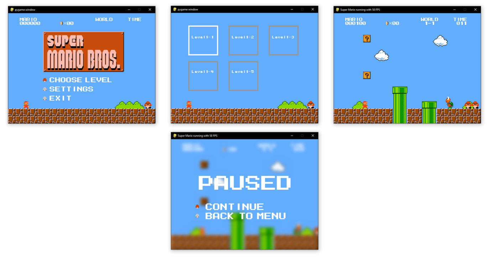

# Super Mario Implementation in Python

This is inspired by Meth-Meth-Method's [super mario game](https://github.com/meth-meth-method/super-mario/)

## Running

- $ pip install -r requirements.txt
- $ python main.py

## Controls

- Left: Move left
- Right: Move right
- Space: Jump
- Shift: Boost
- Left/Right Mouseclick: secret

## Current state

